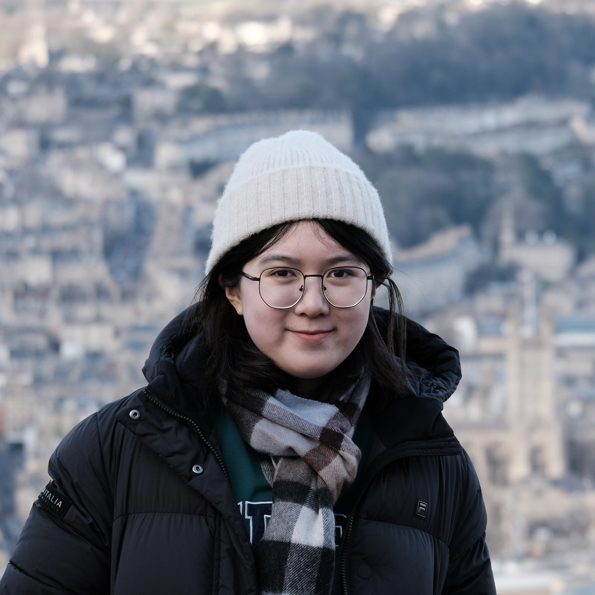
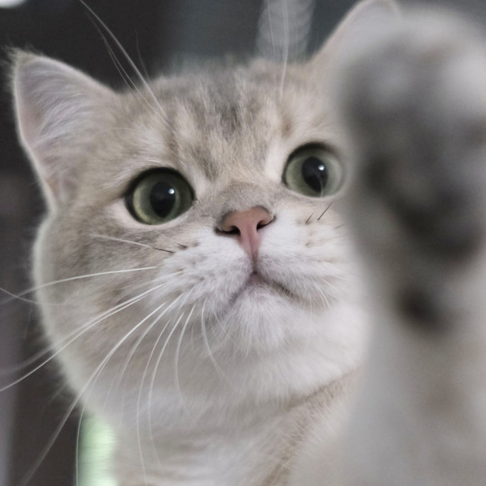
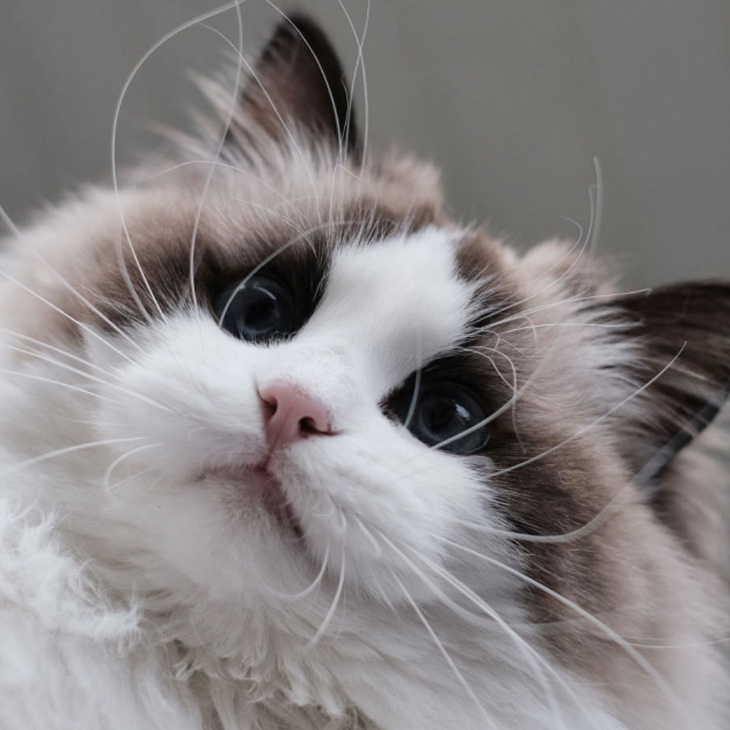

## About Me

Hi! I am **Kexin (Caasi) HUANG**, a second-year master's student in Computer Science at Fudan University, supervised by [Prof. Xipeng QIU](https://xpqiu.github.io/en.html). 
Before that, I served as a research assistant at Shanghai Artificial Intelligence Laboratory, and I received my bachelor's degree in Computer Science at Fudan University. My current research interest primarily focuses on **Multimodal LLM**.

🙋 **Expected to graduate in 2027, feel free to connect!**

[Email](huangkx19@gmail.com) / [Google Scholar](https://scholar.google.com/citations?user=JDcYYZ4AAAAJ&hl) / [GitHub](https://github.com/KexinHUANG19) / [LinkedIn](https://www.linkedin.com/in/caasi-kexin-huang0426/)

 
 

## Publications & Projects
You can find the full list of papers at [Google Scholar](https://scholar.google.com/citations?user=JDcYYZ4AAAAJ&hl).  
(Chronologically listed, most recent first. \* denotes equal contribution)

* **MOSS-VoiceGenerator**  
[Website](http://mosi-ai.com/models/moss-voice-generator) / [GitHub](https://github.com/OpenMOSS/MOSS-TTS/blob/main/docs/moss_voice_generator_model_card.md) / [Huggingface](https://huggingface.co/OpenMOSS-Team/MOSS-VoiceGenerator)   
Core Contributor

* **WESR: Scaling and Evaluating Word-level Event-Speech Recognition**  _(ACL 26' Findings)_   
[Paper](https://arxiv.org/pdf/2601.04508) / [GitHub](https://github.com/Cr-Fish/WESR)  
Chenchen Yang, **Kexin Huang**, Liwei Fan, Qian Tu, Botian Jiang, Dong Zhang, Linqi Yin, Shimin Li, Zhaoye Fei, Qinyuan Cheng, Xipeng Qiu

* **InstructTTSEval: Benchmarking Complex Natural-Language Instruction Following in Text-to-Speech Systems**  _(arXiv 25')_  
[Paper](https://arxiv.org/pdf/2506.16381) / [GitHub](https://github.com/KexinHUANG19/InstructTTSEval)   
**Kexin Huang**, Qian Tu, Liwei Fan, Chenchen Yang, Dong Zhang, Shimin Li, Zhaoye Fei, Qinyuan Cheng, Xipeng Qiu

 
 

## Members

 
 
**Paopao**   
4-year-old British Shorthair  
Bully at home, coward outside

 

 
**Meimei**  
4-year-old Ragdoll  
Graceful and poised, with a laidback vibe

 
 
 

<strong>Glad to See You Here:D</strong>

