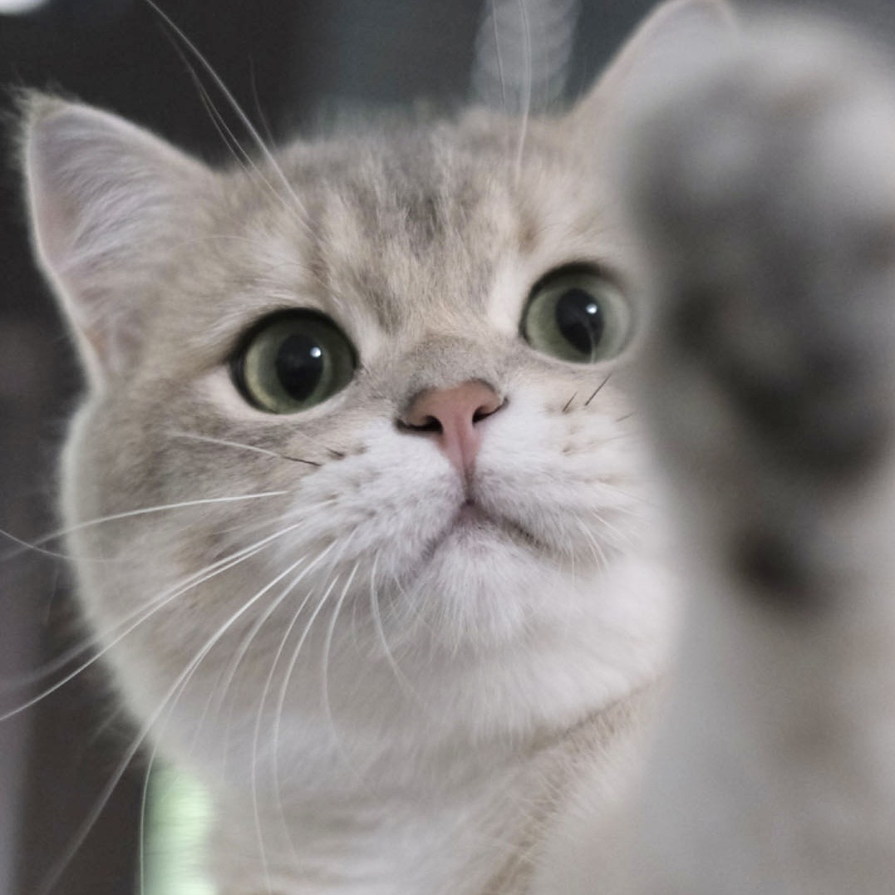

## About Me

Hiiiii! I am **Kexin (Caasi) HUANG**, a first-year master's student in Computer Science at Fudan University, supervised by [Prof. Xipeng QIU](https://xpqiu.github.io/en.html). 
Before that, I served as a research assistant at Shanghai Artificial Intelligence Laboratory, advised by Dr. Yan TENG. And I received my bachelor's degree in Computer Science at Fudan University, advised by [Prof. Yang CHEN](https://chenyang03.wordpress.com/). My current research interest primarily focuses on **LLM alignment**.

[Email](huangkx19@gmail.com) / [Google Scholar](https://scholar.google.com/citations?user=JDcYYZ4AAAAJ&hl) / [GitHub](https://github.com/KexinHUANG19) / [LinkedIn](https://www.linkedin.com/in/caasi-kexin-huang0426/) / [CV](resume.pdf)

 
 
 

## Selected Publications
You can find the full list of papers at [Google Scholar](https://scholar.google.com/citations?user=JDcYYZ4AAAAJ&hl).  
(\* denotes equal contribution)

* **MLLMGuard: A Multi-dimensional Safety Evaluation Suite for Multimodal Large Language Models**  
[Paper](https://arxiv.org/abs/2406.07594) / [GitHub](https://github.com/Carol-gutianle/MLLMGuard)   
Tianle Gu, Zeyang Zhou, **Kexin Huang**, Dandan Liang, Yixu Wang, Haiquan Zhao, Yuanqi Yao, Xingge Qiao, Keqing Wang, Yujiu Yang, Yan Teng, Yu Qiao, Yingchun Wang

* **Flames: Benchmarking Value Alignment of LLMs in Chinese** _(NAACL 24')_  
[Paper](https://aclanthology.org/2024.naacl-long.256/) / [GitHub](https://github.com/AIFlames/Flames) / [OpenCompass](https://flames.opencompass.org.cn/leaderboard)  
**Kexin Huang\***, Xiangyang Liu\*, Qianyu Guo\*, Tianxiang Sun, Jiawei Sun, Yaru Wang, Zeyang Zhou, Yixu Wang, Yan Teng, Xipeng Qiu, Yingchun Wang, Dahua Lin
  
* **Fake Alignment: Are LLMs Really Aligned Well?** _(NAACL 24')_    
[Paper](https://aclanthology.org/2024.naacl-long.263/) / [GitHub](https://github.com/AIFlames/Fake-Alignment)  
Yixu Wang, Yan Teng, **Kexin Huang**, Chengqi Lyu, Songyang Zhang, Wenwei Zhang, Xingjun Ma, Yu-Gang Jiang, Yu Qiao, Yingchun Wang

 
 
 

## Members
<table>
    <tr>
        <td>
            
        </td>
        <td>
            
        </td>
    </tr>
    <tr>
        <td>
            <strong>Paopao</strong> 
            2-year-old British Shorthair 
            Bully at home, coward outside
        </td>
        <td>
            <strong>Meimei</strong> 
            2-year-old Ragdoll 
            Graceful and poised, with a laidback vibe
        </td>
    </tr>
</table>

 **Paopao**  
2-year-old British Shorthair  
Bully at home, coward outside

 **Meimei**  
2-year-old Ragdoll  
Graceful and poised, with a laidback vibe
